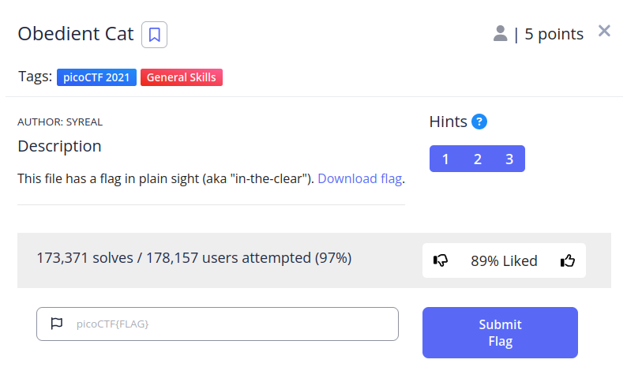
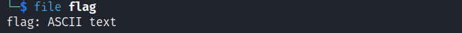

 

In the challenge, we were given a file named "flag" and were asked to find the flag given that it is stored in plain sight.
we run the "file" command on the flag

We see that it is an ASCII text.
There is a command called "strings" that extracts human readable characters from a file. We can run it:

And this is our flag.
