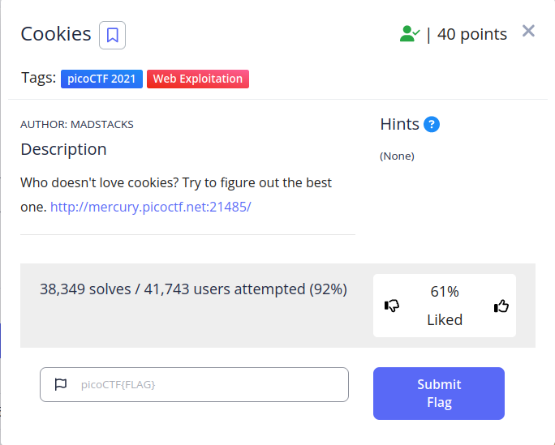
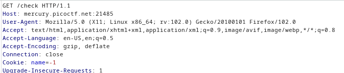
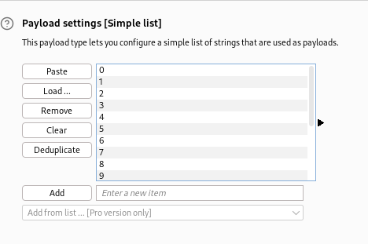
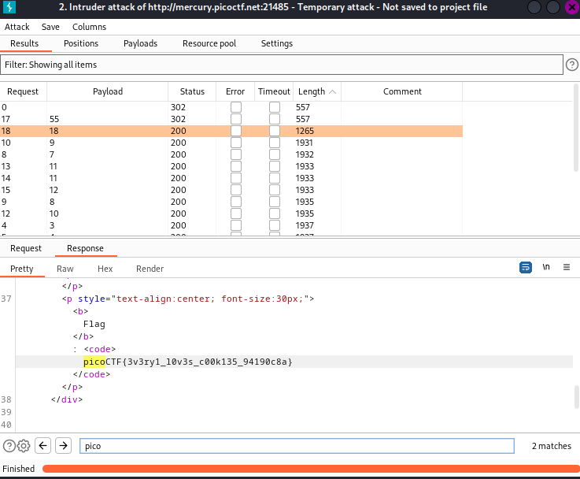
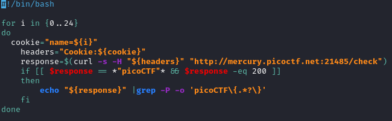
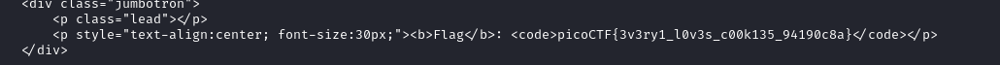

 

The Cookie Challenge tests your ability to find a hidden flag by brute-forcing cookies in a web application.

1. `Utilize "right-click + view source" or "Ctrl+U" to access page source for assistance in solving the challenge.`

Next we need to send the Request to Intruder.
To do this, right-click on the request you want to send to Intruder in the "Proxy" tab and select "Send to Intruder" or press CTRL+I.   

Next,move to payload tab and upload your payload {-55..55} as shown in the image below.

Finally, find the different lengths, as illustrated in the second image.

2. `You can also write your own script to brute-force the cookies, as demonstrated in the following image.`

## Flag

