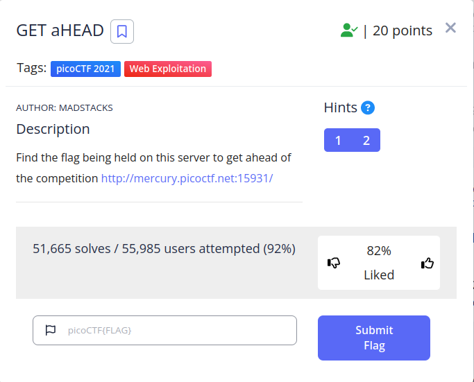

 

The "GET aHEAD" challenge is a web security challenge where the user needs to use the HTTP HEAD method to retrieve header information from a website and find a hidden flag.

 The challenge highlights the importance of understanding different HTTP methods in web application security.
 
 You can use Curl (cURL is a command-line tool used for transferring data to or from a server, supporting various protocols including HTTP, FTP, and SMTP.)
 

 `#!/bin/bash`
`curl "http://mercury.picoctf.net:15931/index.php" -I HEAD -s | grep pico | cut -d ":" -f 2`

Flag
`picoCTF{r3j3ct_th3_du4l1ty_82880908}`
