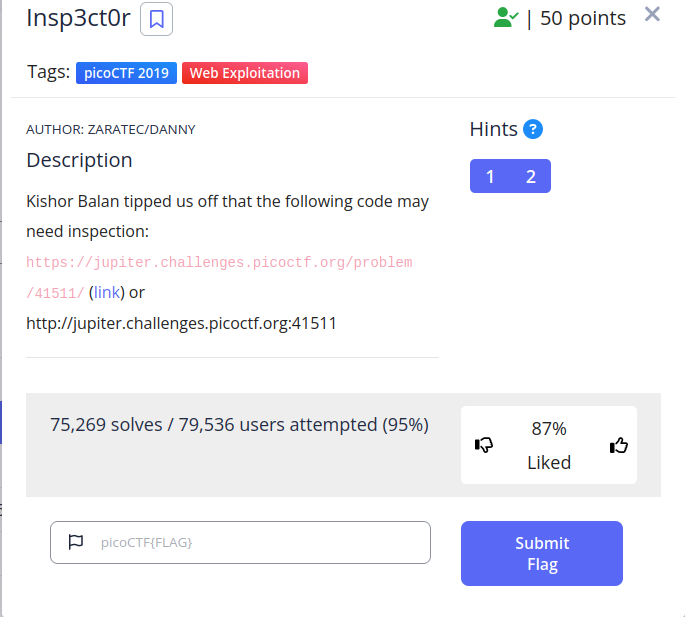
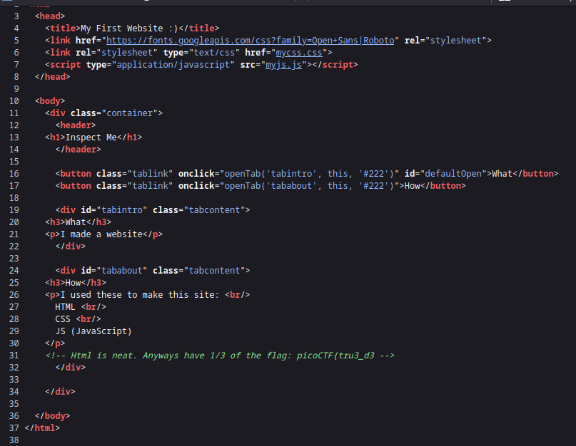
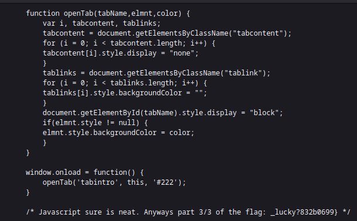
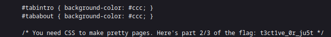

 

The "Insp3ctor" challenge.
By searching in the source code and CSS/JS files, I was able to find the flag.

The HTML content :

The JS file :

 
The CSS file :

Flag
`picoCTF{tru3_d3t3ct1ve_0r_ju5t_lucky?832b0699}`
