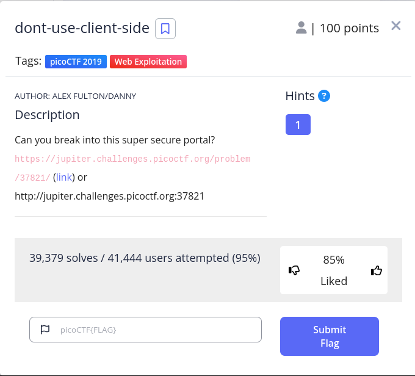
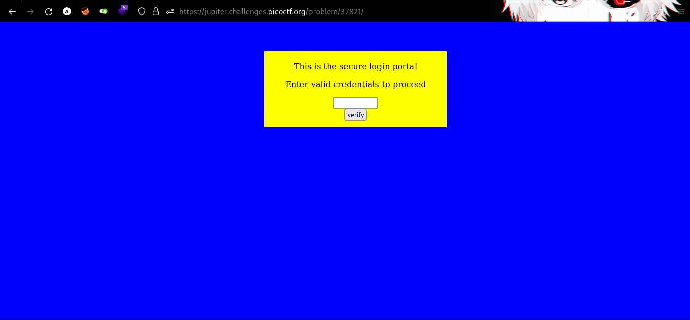
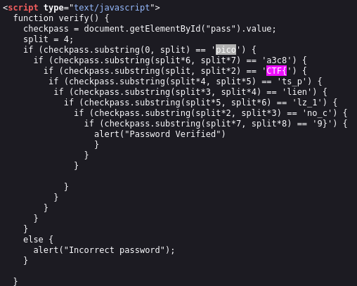

 

The dont-use-client-side Challenge

 
By examining the source code, we can clearly observe a section of the flag.
 

 
`pico` | `CTF{` | `a3c8` | `ts_p` | `lien` | `lz_1` | `no_c` | `9}`
 
Let's generate a flag by combining these parts.
 
`picoCTF{no_clients_plz_1a3c89}`
 

`curl -s https://jupiter.challenges.picoctf.org/problem/37821/ | awk -F "'" '/if /{print $2}' | tr '\n' ' ' | awk '{print $1 $3 $7 $5 $4 $6 $2 $8}'
`
## flag
picoCTF{no_clients_plz_1a3c89}
