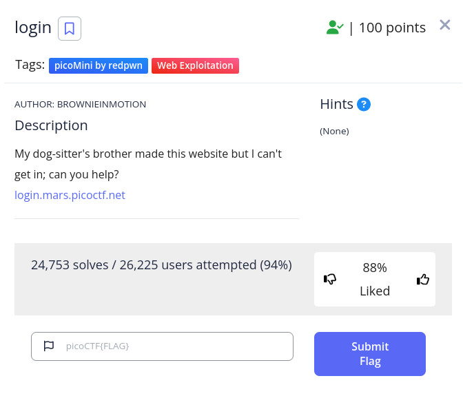
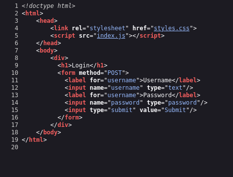
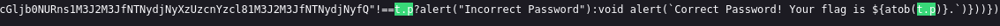

 

The "Login" challenge assesses your proficiency in deciphering JavaScript code and locating an encrypted flag

 `You can use right-click + view source or CTFL+U to page source`

 
Now, let's proceed with reading the JavaScript file.
 

 
`"cGljb0NURns1M3J2M3JfNTNydjNyXzUzcnYzcl81M3J2M3JfNTNydjNyfQ"!==t.p`

`Your flag is ${atob(t.p)`
The {atob} function facilitates the decoding process of a base64-encoded string, transforming it back to its original form.

flag base64 = 'cGljb0NURns1M3J2M3JfNTNydjNyXzUzcnYzcl81M3J2M3JfNTNydjNyfQ'
 
You can use online tools like CyberChef, Base64Decode.org, or various programming languages (e.g., Python, JavaScript) to decode base64-encoded strings

